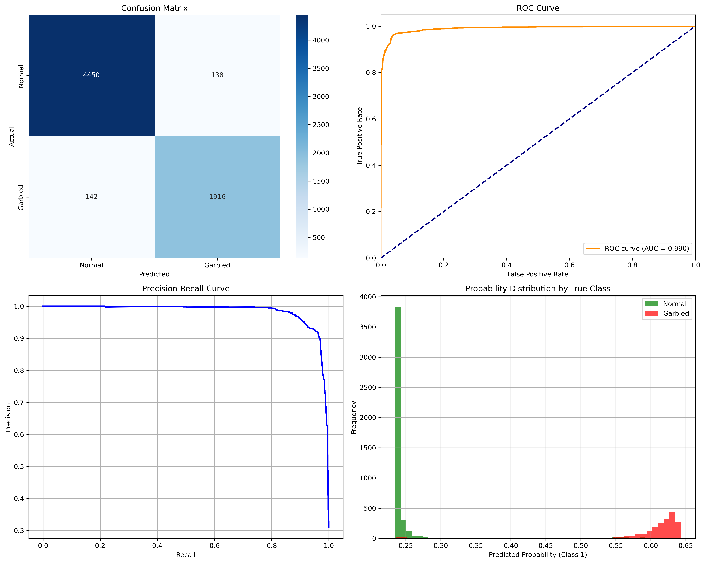
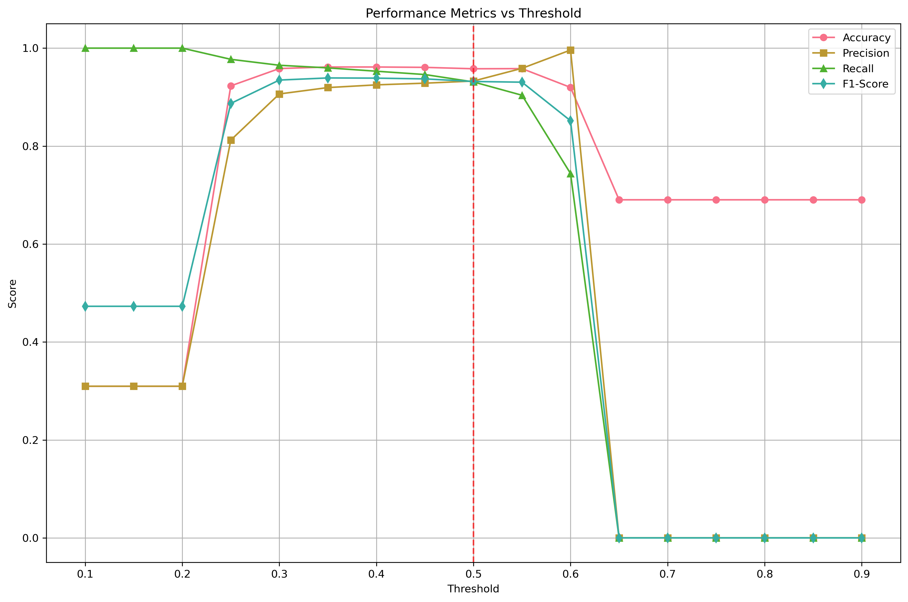
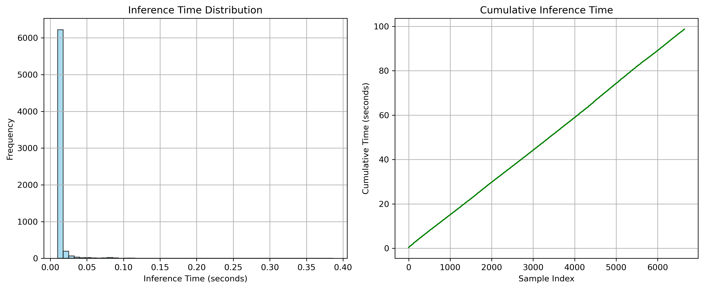

# Model Evaluation Report

## Overview
This report provides a comprehensive evaluation of the binary text classification model on the validation dataset.

## Dataset Information
- **Total Samples**: 6,646
- **Evaluation Date**: 2025-09-30 12:27:56

## Model Information
- **Device**: mps
- **Total Parameters**: 14,350,874
- **Model Size**: 54.7 MB
- **Max Sequence Length**: 1000000000000000019884624838656

## Model Performance Metrics

### Classification Metrics
| Metric | Score |
|--------|-------|
| **Accuracy** | 0.9579 |
| **Precision** | 0.9328 |
| **Recall** | 0.9310 |
| **F1-Score** | 0.9319 |
| **ROC-AUC** | 0.9903 |

### Inference Performance
| Metric | Value |
|--------|-------|
| **Total Inference Time** | 100.44 seconds |
| **Average Inference Time** | 14.85 ms |
| **Throughput** | 66.2 samples/second |

## Detailed Analysis

### Classification Report
```
              precision    recall  f1-score   support

      Normal       0.97      0.97      0.97      4588
     Garbled       0.93      0.93      0.93      2058

    accuracy                           0.96      6646
   macro avg       0.95      0.95      0.95      6646
weighted avg       0.96      0.96      0.96      6646

```

### Confusion Matrix Analysis
The confusion matrix shows the model's performance across both classes:
- **True Negatives (Normal correctly classified)**: 4450
- **False Positives (Normal misclassified as Garbled)**: 138
- **False Negatives (Garbled misclassified as Normal)**: 142
- **True Positives (Garbled correctly classified)**: 1916

## Visualizations

### 1. Model Performance Plots


### 2. Threshold Analysis


### 3. Performance Analysis


## Recommendations

### Model Performance
- **ROC-AUC of 0.990** indicates excellent discriminative ability
- **F1-Score of 0.932** shows excellent balance between precision and recall

### Inference Speed
- **66.2 samples/second** throughput is good for production deployment
- Average inference time of **14.85ms** per sample

## Files Generated
- `evaluation_plots.png` - Main performance visualizations
- `threshold_analysis.png` - Threshold sensitivity analysis  
- `performance_analysis.png` - Inference performance metrics
- `detailed_results.json` - Raw evaluation data
- `detailed_predictions.csv` - Individual predictions and probabilities

---
*Report generated automatically by the detailed evaluation script*
